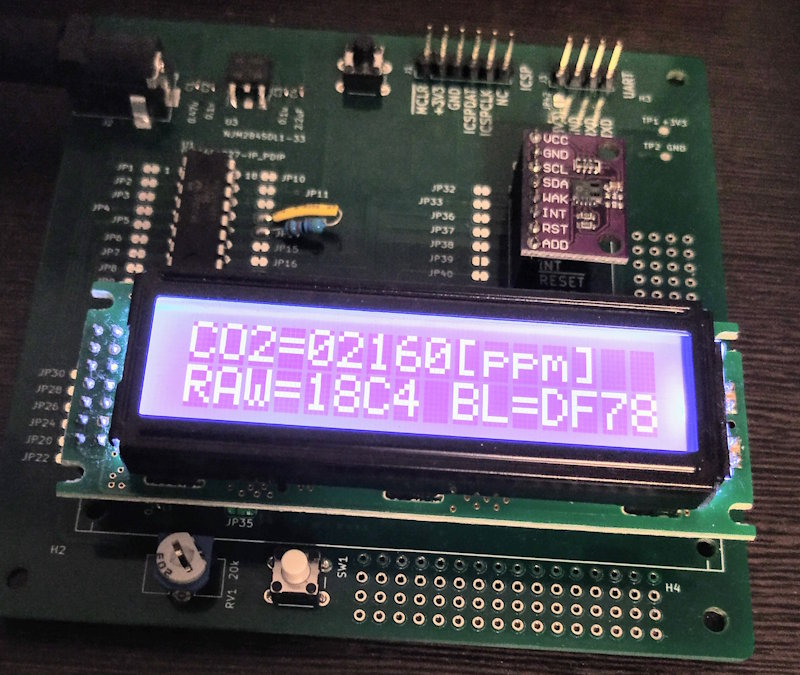
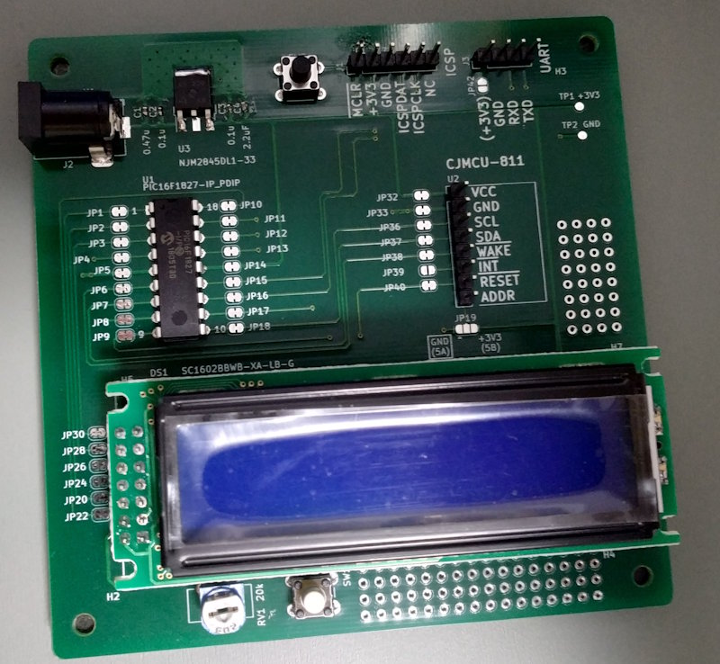
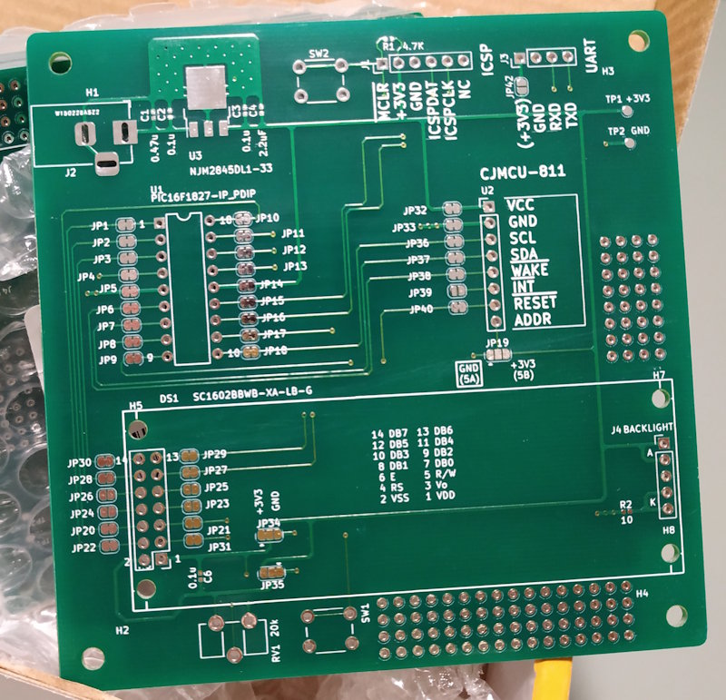
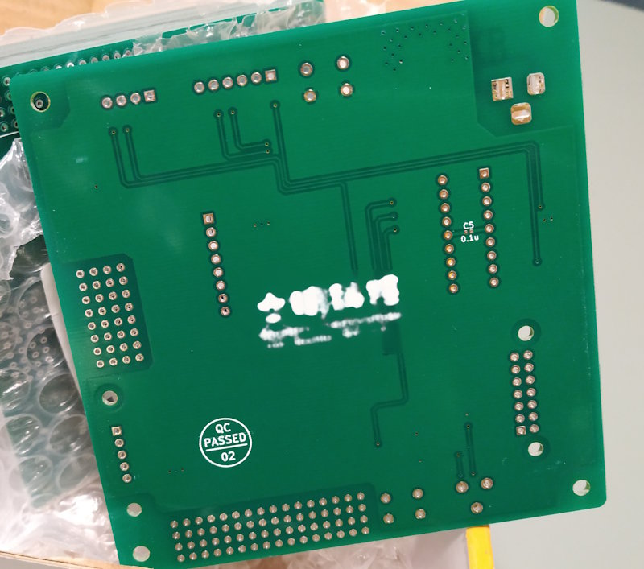

# CCS811 CO2 モニター

CCS811を使った、CO2 換算値（eCO2）モニタボードです。1秒ごとにキャラクタ液晶に測定値を表示します。表示される値は CCS811 による換算値であり、CO2 濃度を直接測定した値ではありません。

## 構成

- センサー: CCS811（I2C アドレス `0x5A`）
- マイコン: PIC16F1827
- 表示器: 16 文字×2 行のキャラクター液晶モジュール（4 ビット接続）
- 操作: スイッチ 1 個、UART コマンド

回路図は [co2pic.pdf](co2pic.pdf)、ネットリストは [co2pic.net](co2pic.net) です。諸事情により、レイアウトデータはありません。

## 部品表（BOM）

| 参照番号 | 部品・仕様 | メーカー | 型番 | 備考 |
| --- | --- | --- | --- | --- |
| C1 | チップ積層セラミックコンデンサ 1005 2.2 µF | 村田 | GRM155R6YA225KE11 | 回路図およびシルクは 0.47 µF と記載 |
| C2 | チップ積層セラミックコンデンサ 1005 0.1 µF | 村田 | GRM155F11E104ZA01 | |
| C3 | チップ積層セラミックコンデンサ 1005 0.1 µF | 村田 | GRM155F11E104ZA01 | |
| C4 | チップ積層セラミックコンデンサ 1005 2.2 µF | 村田 | GRM155R6YA225KE11 | |
| C5 | チップ積層セラミックコンデンサ 1005 0.1 µF | 村田 | GRM155F11E104ZA01 | |
| C6 | チップ積層セラミックコンデンサ 1005 0.1 µF | 村田 | GRM155F11E104ZA01 | |
| DS1 | 3.3 V キャラクタ液晶モジュール | Sunlike Display Tech. Corp. | SC1602BBWB-XA-LB-G | [販売ページ](http://akizukidenshi.com/catalog/g/gP-04794/) |
| J1 | 2.54 mm ピンヘッダ 1×6 ピン | ？ | ？ | [販売ページ](http://akizukidenshi.com/catalog/g/gC-00167/) |
| J2 | 2.1 mm 標準 DC ジャック（4 A）、基板取付用 | マル信無線電機株式会社 | MJ-179PH | |
| J3 | 2.54 mm ピンヘッダ 1×4 ピン | ？ | ？ | [販売ページ](http://akizukidenshi.com/catalog/g/gC-00167/) |
| J4 | 2.54 mm ピンヘッダ 1×5 ピン | ？ | ？ | [販売ページ](http://akizukidenshi.com/catalog/g/gC-00167/) |
| R1 | チップ抵抗 1005 4.7 kΩ | ？ | ？ | |
| R2 | チップ抵抗 1005 10 Ω | ？ | ？ | |
| R3 | 1/4 W リード抵抗 47 kΩ | ？ | ？ | JP13 と JP14 の上に実装 |
| RV1 | 半固定ボリューム 20 kΩ | SUNTAN TECHNOLOGY CO LTD | TSR-065-203-R | |
| SW1 | タクトスイッチ | Cosland Co,. Ltd. | DTS-6-V | |
| SW2 | タクトスイッチ | Cosland Co,. Ltd. | DTS-6-V | |
| U1 | PIC16F1827-IP_PDIP | Microchip | PIC16F1827-IP_PDIP | |
| U2 | CO2 センサ基板 | 南京峙溱电子科技有限公司 | CJMCU811 | [製品ページ](http://www.cjmcu.com/goods.php?id=81) |
| U3 | LDO 3.3 V | 新日本無線 | NJM2845DL1-33 | |

## ビルド

1. MPLAB X IDE でこのディレクトリを既存プロジェクトとして開きます。
2. ターゲットを PIC16F1827、コンパイラを XC8 に設定します。
3. `default` 構成をビルドします。

プロジェクト設定には XC8 v2.05 が記録されています。生成コードのヘッダーには XC8 v2.00、MPLAB X v5.10 でのテスト情報が記録されています。ほかのバージョンでのビルドは確認していません。

## 操作

通常画面には eCO2 換算値、CCS811 のベースライン、時刻を表示します。スイッチを短く押すと、RAW データ表示、ベースライン保存、ベースライン復元、時・分の調整メニューを順に切り替えます。各項目で長く押すと、その操作を実行します。時計は Timer2 割り込みで進むソフトウェア時計です、PICの内部オシレータが基準なのであまり信用しないでください。

### UART コマンド

UART は **LVCMOS3.3**、9600 bps、8 データビット、パリティなし、1 ストップビットです。コマンドと引数を半角スペースで区切り、Enterで送信します。コマンド名は小文字で入力してください。

| コマンド | 操作 |
| --- | --- |
| `?` | コマンドのヘルプを表示 |
| `l [line1] [line2]` | LCD の1行目、2行目に文字列を表示 |
| `lw [rs] [dt]` | LCD に1バイト送信。`rs=00` は命令、`rs=01` は表示データ |
| `w [addr] [dt1] [dt2] ...` | CCS811 のレジスタへ書き込み。データは最大6バイト |
| `r [addr] [cnt]` | CCS811 のレジスタから読み取り。`cnt` は最大8バイト |
| `rw [h] [m] [s]` | ソフトウェア時計の時・分・秒を設定 |
| `rr` | 時計を `RTC=hh:mm:ss` 形式で表示 |
| `ew [addr] [dt]` | EEPROM の指定アドレスに1バイト書き込み |
| `er` | EEPROM の全256バイトを16行×16バイトの16進数で表示 |

`lw`、`w`、`r`、`ew` の数値引数は **16進数**（例: `0A`）、`rw` の時・分・秒は **10進数**（例: `12 34 56`）で指定します。レジスタや EEPROM の読み取り値も16進数で表示されます。時計の設定値は範囲チェックされないため、`rw` には時 0–23、分・秒 0–59 を指定してください。

## ライセンス

各ファイルの表記に従ってください。
